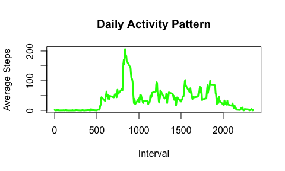
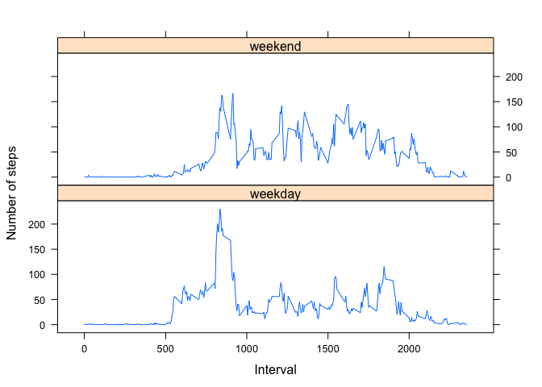

# Reproducible Research: Peer Assessment 1

This is a R Markdown document for Programming Assignment 1 of the Reproducible Research class.

## Loading and preprocessing the data


```r
# Load data
data <- read.csv("activity.csv")
```


```r
# Process or transform the data for analysis
# Ignore NA
library(dplyr,warn.conflicts=F)
d <- group_by(data,date) %>%
    summarize(day.tot=sum(steps,na.rm=T)) 
# total steps per day
t <- group_by(data,interval) %>%
    summarize(int.avg=mean(steps,na.rm=T)) 
# average steps per interval
```

## What is mean total number of steps taken per day?


```r
# Make a HISTOGRAM of total steps per day
par(mfrow=c(1,1))
hist(d$day.tot,
     breaks=26,
     xlab="Steps per Day",
     main="Histogram of Steps per Day",
     xlim=c(0,25000),
     ylim=c(0,20),
     col="red")
rug(d$day.tot)
```

 


```r
# Calculate the mean and median total steps per day
# Ignore NA
d.avg <- mean(d$day.tot)
d.med <- median(d$day.tot)
d.avg <- as.integer(d.avg) # for display
d.med <- as.integer(d.med)
```

The step average is 9354.  The median is 10395.

## What is the average daily activity pattern?


```r
with(t,plot(interval,int.avg,type="l",
            xlab="Interval",
            ylab="Average Steps",
            main="Daily Activity Pattern",
            col="green",
            lwd=3))
```

 


```r
# Find interval with maximum steps
idx <- which.max(t$int.avg)
t.max <- t$interval[idx]
```

The interval with maximum steps is 835.

## Imputing missing values


```r
# Count number of missing values
idx <- is.na(data$steps)
count <- sum(idx)
```

The number of NA values is 2304, which is all intervals for eight different days. 

**Strategy**:  Impute across intervals using `impute` function.


```r
# Create impute function
# This function will impute the average across dates, or intervals
impute <- function(x) {
    m <- mean(x,na.rm=T)
    if (is.na(m)) {m=0.0} 
    bad <- is.na(x)
    x[bad] <- m
    x
}
```


```r
# Impute NA data across dates
f <- data
# dates <- factor(f$date)
# temp <- split(f$steps,dates)
intervals <- factor(f$interval)
temp <- split(f$steps,intervals)
temp <- lapply(temp,impute)
# f$steps <- unsplit(temp,dates)
f$steps <- unsplit(temp,intervals)
```


```r
# Histogram with imputed data
g <- group_by(f,date) %>%
    summarize(day.tot=sum(steps)) 
# total steps per day
# Make a HISTOGRAM of total steps per day
hist(g$day.tot,
     breaks=26,
     xlab="Steps per Day",
     main="Histogram of Steps per Day, with Imputed Data",
     xlim=c(0,25000),
     ylim=c(0,20),
     col="blue")
rug(g$day.tot)
```

 

The histogram shifted eight counts from the 0 bin to the average bin.


```r
# Calculate the mean and median total steps per day
# Ignore NA
g.avg <- mean(g$day.tot)
g.med <- median(g$day.tot)
g.avg <- as.integer(g.avg) # for display
g.med <- as.integer(g.med)
```

The imputed mean is 10766.  The mean equals the mode and the median.  It is the mode because the mean occurs eight times.  The multiplicity includes the 50% percentile, which makes it the median.  The imputed median is 10766. 

## Are there differences in activity patterns between weekdays and weekends?


```r
# Create weekday/weekend factor variable
days <- weekdays(as.Date(data$date))
wdays <- rep("",length(days))
for (k in seq_along(days)) {
    if (days[k]=="Saturday" | days[k] == "Sunday") {
        wdays[k] <- "weekend"
    }
    else {
        wdays[k] <- "weekday"
    }
}
wdays <- factor(wdays)
```


```r
# Reduce data
f$wdays <- wdays
f <- group_by(f,wdays,interval) %>%
    summarize(int.avg=mean(steps)) %>%
    ungroup()
```


```r
# Plot the data
library(lattice)
xyplot(int.avg ~ interval | wdays, data=f,
       type="l",
       xlab="Interval",
       ylab="Number of steps",
       layout=c(1,2),
       scales=list(
           y=list(tick.number=5),
           x=list(at=c(0,500,1000,1500,2000))))
```

 

The activity patterns are different.
